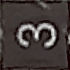

# 本文档记录在某项目中[Fast-Drone-XI35](https://github.com/Longer95479/Fast-Drone-XI35)的数字目标识别部分
## 任务目标：识别目标区域和禁飞区域
示例：
目标区：

 <!-- 此路径表示图片和MD文件，处于同一目录 -->

禁飞区：

 <!-- 此路径表示图片和MD文件，处于同一目录 -->

## 文档组成：
# 我们开源了使用的数据集，希望能帮到有类似需求的你！
```python
└─dataset_opensource
    ├─captured_CSI_camera_indoor #室内等比例缩放图像采集结果
    │  ├─1
    │  ├─...
    ├─captured_CSI_camera_outdoor #室外等比例缩放图像采集结果
    ├─emnist_dataset #emnist 数据集
    ├─final_used_dataset# 最后使用的数据集
    │  ├─1
    │  ├─...
    │  └─Z
    ├─generated_dataset_YOLO #合成的YOLO数据集
    │  ├─images
    │  │  ├─test
    │  │  └─train
    │  └─labels
    │      ├─test
    │      └─train
    ├─letters_testset #字母数据集test
    │  ├─1
    │  ├─...
    │  └─9
    └─letters_trainset #字母数据集train
        ├─A
        ├─...
        └─Z
```
### 思路1：使用emnist数据集和mnist数据集组合成需要的数据集并训练分类
```python
class CustomMNIST(Dataset):
    def __init__(self, data, targets, transform=None):
        self.data = data
        self.targets = targets
        self.transform = transform
        
    def __len__(self):
        return len(self.targets)
    
    def __getitem__(self, index):
        img, target = self.data[index], int(self.targets[index])
        img = img.numpy().astype('uint8')
        img = torchvision.transforms.functional.to_pil_image(img)
        if self.transform is not None:
            img = self.transform(img)
        return img, target
#letter
letters_dataset = ImageFolder(root="./letters_trainset", transform=transform_custom)
#digit
mnist_train = torchvision.datasets.MNIST(root='./data', train=True, download=True, transform=transform)
target_digits = [1, 2, 3]
idx_train = (mnist_train.targets == target_digits[0]) | (mnist_train.targets == arget_digits[1]) | \
            (mnist_train.targets == target_digits[2])
mnist_data_train = mnist_train.data[idx_train]
mnist_targets_train = mnist_train.targets[idx_train]
custom_mnist_dataset_train = CustomMNIST(mnist_data_train, mnist_targets_train, ransform=transform)

#合并数据集
train_dataset_stage1 = ConcatDataset([letters_dataset, custom_mnist_dataset_train])
train_loader_stage1 = DataLoader(dataset=train_dataset_stage1, batch_size=8, shuffle=True, collate_fn=custom_collate_stage1)
```

### 思路2：YOLO，但是为了降低标注成本手工合成
**代码：GOTO generate_dataset_YOLO.py**
结果：

 

### 思路3：根据外部实飞测试得到结果
实飞录像结果：

 
 


根据上述结果进行生成仿真，以干扰F举例

生成：

 

实拍：


代码部分：
```python
font = ImageFont.truetype("BodoniFLF-Bold.ttf", font_size)
img = Image.new("RGB", image_size, background_color)
draw = ImageDraw.Draw(img)

        # 计算文字的尺寸和位置，以便居中绘制
bbox = draw.textbbox((0, 0), letter, font=font)
text_width, text_height = bbox[2] - bbox[0], bbox[3] - bbox[1]

# 计算绘制位置，将文字居中
text_x = (image_size[0] - text_width) / 2 - bbox[0]
text_y = (image_size[1] - text_height) / 2 - bbox[1]

# 绘制文字
draw.text((text_x, text_y), letter, fill=text_color, font=font)


# 绘制文字
draw.text((text_x, text_y), letter, fill=text_color, font=font)

# 在0, 90, 180, 270度之间随机选择一个旋转角度
rotation_angle = random.choice([0, 90, 180, 270])
img = img.rotate(rotation_angle, resample=Image.BICUBIC, expand=False)

# 轻微模糊
img = img.filter(ImageFilter.GaussianBlur(radius=1.5))

# 添加椒盐噪声
img_array = np.array(img)
noise_prob = 0.02
salt_vs_pepper = 0.5
num_salt = int(noise_prob * img_array.size * salt_vs_pepper)
num_pepper = int(noise_prob * img_array.size * (1 - salt_vs_pepper))

coords = [np.random.randint(0, i - 1, num_salt) for i in img_array.shape[:2]]
img_array[coords[0], coords[1]] = [255, 255, 255]
coords = [np.random.randint(0, i - 1, num_pepper) for i in img_array.shape[:2]]
img_array[coords[0], coords[1]] = [0, 0, 0]
img = Image.fromarray(img_array)

# 随机添加震动模糊
# 创建一个简单的运动模糊核
kernel_size = 5
angle = random.choice([0, 90])  # 随机在水平或垂直方向上应用
if angle == 0:  # 水平方向
    kernel = [1/kernel_size] * kernel_size + [0] * (kernel_size * (kernel_size - 1))
    kernel = np.reshape(kernel, (kernel_size, kernel_size)).tolist()
else:  # 垂直方向
    kernel = [0] * (kernel_size * (kernel_size - 1)) + [1/kernel_size] * kernel_size
    kernel = np.reshape(kernel, (kernel_size, kernel_size)).tolist()

# 应用运动模糊内核
kernel = ImageFilter.Kernel((kernel_size, kernel_size), sum(kernel, []), scale=None)
img = img.filter(kernel)
```
**为了进一步贴近真实图像，还采用了Bodini字体，tff文件已共享**

还将操场和跑道的图像也纳入数据集：


### 最终得到的训练参数导出为onnx文件并开源：classifier.onnx

## usage：
```python
check.sh:检查gpu
transfer.py：pth转为onnx
to_tensorRT.py：tensorRT加速
onnx_forward.py：测试onnx
```
其余文件已有注释文件说明